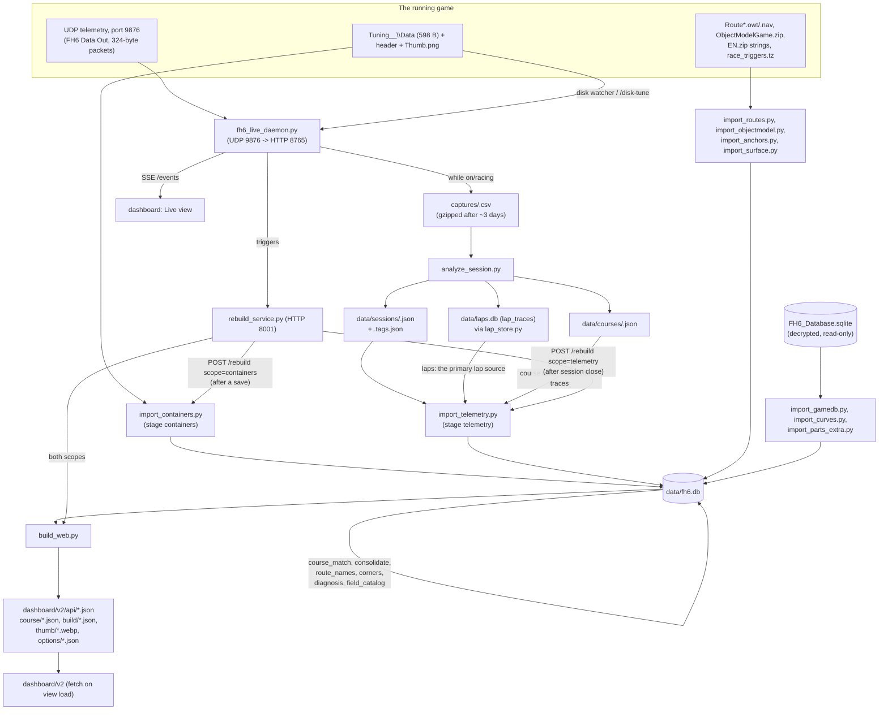

# Data structures and locations — the FH6 lab, as it actually exists

This replaces an Eraser export ("Forza Horizon 6 Tuning Project — Database Schema &
Infrastructure Reference") that described a PostgreSQL "garage" database, `capture_session` /
`telemetry_packet` / `tire_channel` / `car_definition` / `share_code` / `solver_run` tables, MCP
servers named telemetry-collector / save-decoder / tune-parser, CSV/Parquet archives and
OS-keychain credentials. **None of that exists in this repository.** The real lab is SQLite +
flat JSON files + plain Python scripts, no server process holds a database, and nothing is
credentialed — every store below is a file on disk. Section 8 tabulates the specific claims
against reality.

Everything here is read from the live worktree on 2026-09-11: `db/schema.sql`,
`scripts/db/fh6db.py`, `scripts/db/rebuild.py`, `scripts/db/build_web.py`,
`scripts/telemetry/fh6_live_daemon.py`, `scripts/telemetry/lap_store.py`,
`scripts/telemetry/analyze_session.py`, `scripts/rebuild_service.py`, `scripts/lab_up.ps1`,
`docs/DATA-INVENTORY.md`, and a read-only query of `data/fh6.db` and `data/laps.db` via
`file:...?mode=ro` URIs. Row counts are measured live counts, not the 2026-09-03 figures
`DATA-INVENTORY.md` was generated from — the two disagree in several places, noted where relevant.

## 1. Architecture summary

| store | engine / format | path | writer | reader | refresh trigger | measured size (2026-09-11) |
|---|---|---|---|---|---|---|
| central database | SQLite (WAL) | `data/fh6.db` | `scripts/db/rebuild.py` stages, each via `scripts/db/fh6db.py` | `scripts/db/build_web.py`, the daemon (route names, read-only), any ad-hoc query | `python scripts/db/rebuild.py` (all stages) or `--only <stage>` (cascades to dependents) | 142.0 MB, 67 tables, 9 views, schema_version 6 |
| lap trace store (v1, still read) | SQLite (WAL) | `data/laps.db` | `scripts/telemetry/lap_store.py:put_laps()`, called from `analyze_session.py` | `scripts/db/import_telemetry.py` (the primary source of `lap` / `lap_point` / `lap_marker`, `import_telemetry.py:217`), `lap_store.py:get_laps()`, the v1 dashboard, `/laps` daemon endpoint | every session analysis pass (see §2) | 19.1 MB, `lap_traces` table, 1,599 rows |
| session recordings | JSON | `data/sessions/<id>.json` (+ `<id>.tags.json`) | `scripts/telemetry/analyze_session.py` | `import_telemetry.py` (stage `telemetry`), the dashboard's Live/session views | on session close (daemon debounce) or `--replay` | 389 session files, 250 `.tags.json` sidecars |
| course models | JSON | `data/courses/<route_key>.json` | `analyze_session.py` (course-model merge) | `import_telemetry.py`, `merge_courses.py`, `build_course_from_laps.py` | same as sessions — rewritten on every analysis pass that touches that course | 132 files |
| dashboard API bundle | JSON (generated, git-ignored) | `dashboard/v2/api/*.json`, `course/*.json`, `build/*.json`, `thumb/*.webp`, `options/*.json` | `scripts/db/build_web.py` | `dashboard/v2/*.js` (fetched by the browser) | after any `rebuild.py` run, via `rebuild_service.py`'s `scope=containers` or `scope=telemetry` | `course/` 25 MB (117 files), `build/` 11 MB (627 files), `thumb/` 32 MB, `options/` 14 MB |
| raw UDP captures | CSV (+ gzip after ~3 days) | `captures/<session_id>.csv[.gz]` | `scripts/telemetry/fh6_live_daemon.py` (writes while `on`) | `analyze_session.py` | continuous while the daemon has a race/session in progress | 85 live `.csv`, 275 `.csv.gz` |
| flat JSON knowledge stores | JSON | `data/*.json` (~50 files, see `docs/DATA-INVENTORY.md` §2) | assorted one-off scripts / hand-maintained | `fh6_live_daemon.py`, `clone_parts.py`, `fh6_tune_decode.py`, dashboard | manual / per-script | see DATA-INVENTORY §2 for the per-file byte counts |
| game save containers | binary (598 B `Data` + `header` + `Thumb.png`) | `C:\XboxGames\GameSave\pgs\u_<id>\<n>\ContainersRoot\Tuning_<ordinal>_<stamp>\` | the game itself | `scripts/telemetry/fh6_tune_decode.py`, `scripts/db/import_containers.py` (stage `containers`), the daemon's disk watcher | on every in-game tune save | 711 `tune_container` rows imported live |
| the decrypted game database | SQLite, read-only | `C:\Users\mondr\Downloads\forza raw data files\FH6_Database.sqlite` | shipped by the game / decrypted offline; never written by this project | `scripts/db/import_gamedb.py`, `import_curves.py`, `import_parts_extra.py`, `fh6db.py --selftest` | never (static reference) | 205 tables in the source; ~36 read into `ref_*` |
| the game's own files (routes, object model, strings, triggers) | `.owt`/`.nav`/zip/XML | under the game's `Content\media\...` tree | the game | `fh6_owt.py`, `fh6_bxml.py`, `fh6_anchors.py`, `fh6_strings.py`, stages `routes`/`objectmodel`/`anchors` | never (static reference) | see §7 |
| live daemon in-memory state | Python process state, not a store | n/a (process `ST` object in `fh6_live_daemon.py`) | the daemon itself, from UDP | SSE `/events` clients, `/health`, `/session.json` | continuous while the daemon runs | n/a |

There is no PostgreSQL anywhere in this repository, no ORM, no message queue, no credential
store, and no MCP server for telemetry/save/tune parsing — those are plain Python modules
imported directly (`fh6_tune_decode.py`, `fh6_owt.py`, `fh6_bxml.py`, `fh6db.py`, etc.), called
either from the command line, from `rebuild.py`, or from the daemon process.

## 2. Data flow



Two independent pipelines feed `data/fh6.db`:

1. **Telemetry.** The game emits UDP telemetry (FH4/FH5/FH6-identical 324-byte packets) to port
   9876. `fh6_live_daemon.py` listens, compacts each packet into a `frame` dict, streams it over
   SSE on HTTP port 8765, and — whenever `IsRaceOn`/`on` is true — appends a row to a CSV under
   `captures/`. `analyze_session.py` turns a capture (live or replayed) into a session JSON
   (`data/sessions/<id>.json`), a set of course-model JSON files (`data/courses/<route_key>.json`)
   and rows in `data/laps.db` (`lap_store.put_laps`). `scripts/db/import_telemetry.py` (rebuild
   stage `telemetry`) reads the session JSON into `session` / `session_car` / `session_event`, the
   course models into `course` / `course_turn`, and **the laps from `data/laps.db`** (`lap_traces`,
   `import_telemetry.py:217`) — supplemented by course-model `speed_traces` only for a lap the store
   does not hold (`:231`) — into `lap`, `lap_marker` and `lap_point`; that
   stage cascades (per `rebuild.py`'s `DOWNSTREAM` map) into `course_match`, `consolidate`,
   `route_names`, `corners` and `diagnosis`.
2. **Saves.** The game writes a tune container to
   `C:\XboxGames\GameSave\pgs\u_<id>\<n>\ContainersRoot\Tuning_<ordinal>_<stamp>\` (a 598-byte
   `Data` file, a `header` file with title/description/creator/XUID, and `Thumb.png`). The
   daemon's `disk_watcher()` thread polls this tree and pushes a `disk` SSE event the moment a new
   container appears; `scripts/db/import_containers.py` (stage `containers`) is the one that
   actually decodes it into `tune_container`/`tune_part`/`tune_slider`/`tune_gear` and rolls builds
   up into `hw_package`/`hw_package_part`/`setup`.

`scripts/rebuild_service.py` (port 8001) is the process that actually runs the rebuild scripts on
the dashboard's behalf: `scope=containers` (triggered by a new save) runs
`rebuild.py --only containers` then `build_web.py`; `scope=telemetry` (triggered by session close)
runs `rebuild.py --only telemetry` (which cascades as above) but — deliberately — does **not**
call `build_web.py` on every trigger, to avoid rewriting ~776 API files every few minutes while
the game sits in menus; `build_web.py` catches up on the next `containers`-scope run.
Everything not tied to a save or a session close (the `gamedb`, `objectmodel`, `events`, `curves`,
`parts_extra`, `routes`, `anchors`, `surface`, `field_catalog` stages) only runs on a manual
`python scripts/db/rebuild.py`.

## 3. `data/fh6.db` — the central database

Opened normally via `fh6db.connect()` (WAL, `PRAGMA foreign_keys=ON`); read-only consumers should
use `fh6db.connect(ro=True)`, which opens `file:<path>?mode=ro`. `schema_meta` currently reads
`schema_version=6` ("PEDALS ON THE TRACE" — `lap_point.thr`/`brk` added 2026-09-11) and
`created_utc=2026-09-02T10:32:39Z`. The schema is defined once in `db/schema.sql`
(runs only on a fresh DB via `ensure_schema()`) and kept in sync on a live DB by
`fh6db.migrate()` (`V2_COLUMNS`/`V2_TABLES`/`V2_VIEWS`), which every `rebuild.py` invocation calls
before running any stage.

67 tables, 9 views, live row counts below (2026-09-11; `docs/DATA-INVENTORY.md`'s counts are from
2026-09-03 and are stale for every growing table — e.g. `lap` was 354 there, 973 live;
`tune_container` was 579, 711 live; `lap_point` was 120,471, 329,505 live).

### Reference layer (`ref_*`) — imported wholesale from the game, never hand-edited

Every `ref_*` table is dropped and repopulated on its owning stage; provenance is one
`import_run` row per stage run.

| table | rows | key columns | purpose |
|---|---|---|---|
| `ref_car` | 662 | `ordinal` PK; `class_id`→`ref_class`; `stock_wheel_id`→`ref_wheel` | every car: names, class, PI (raw + normalized), weight, drivetrain, ratings, stock parts |
| `ref_class` | 8 | `class_id` PK | the D..X class ladder and its display-PI anchors |
| `ref_engine` | 670 | `engine_id` PK | swappable engines: name, config, cylinders, displacement, mass, redline |
| `ref_drivetrain` | 662 | `drivetrain_id` PK | drivetrain sets, incl. shared swap sets |
| `ref_car_body` | 779 | `carbody_id` PK; `ordinal`→`ref_car` | body variants / kits per car |
| `ref_motor` | 19 | `motor_id` PK | electric motors (mass, battery, redline) |
| `ref_slot` | 50 | `slot_index` PK, `slot` unique | THE MENU MAP: the 50 save-file part slots, their menu area/order, category |
| `ref_part` | 87,655 | PK (`slot`,`part_id`) | every purchasable part: name, price, mass diff, tile position, aspiration gate |
| `ref_part_slider` | 65,864 | PK (`slot`,`part_id`,`slider`) | the tuning band a fitted part supplies (min/max/default) |
| `ref_slider` | 36 | `slider` PK | the 36 tuning sliders in save-file order, unit, band source |
| `ref_wheel` | 1,248 | `wheel_id` PK | every rim: mass, mass_level (weight class), menu tile position |
| `ref_wheel_category` | 5 | `category_id` PK | rim categories (Stock/Sport/Multi Piece/Specialized/All) |
| `ref_compound` | 41 | `compound_id` PK | tyre compounds: slip peaks, friction scale |
| `ref_friction_curve` | 738 | `curve_id` PK; `compound_id`→`ref_compound` | the friction curve behind every compound/channel/surface/load band (explode via `v_friction_point`) |
| `ref_torque_curve` | 1,725 | `curve_id` PK | dyno per camshaft part or electric motor (explode via `v_torque_point`) |
| `ref_part_attribute` | 546 | `attribute_id` PK | `List_PartAttribute` verbatim — legacy engine data, cannot be keyed to a part (see schema.sql comment) |
| `ref_preset` | 448 | `preset_id` PK; `ordinal`→`ref_car` | the game's own finished builds (448 over 258 cars), 49-slot parts + 46-float tuning blob |
| `ref_preset_part` | 17,617 | PK (`preset_id`,`slot`) | one preset's part list |
| `ref_car_exception` | 511 | `ordinal` PK | livery/graphics exceptions per car (NOT upgrade gating — see schema.sql name warning) |
| `ref_track` | 58 | `track_id` PK | legacy track table |
| `ref_event` | 379 | `event_id` PK | the Rivals catalogue as displayed: name, length_m (±80 m by construction), is_loop |
| `ref_event_string` | 898 | PK (`event_id`,`table_name`,`key_hash`) | the guid join that proves an event name against the game's own strings |
| `ref_region` | 91 | `region_id` PK | map regions |
| `ref_string_table` / `ref_string` | 287 / 58,722 | composite | the game's 288 `.str` tables, hash-addressed |
| `ref_route` | 170 | `route_id` PK | the 169 (+1) `.owt` route centre-lines: length, loop, bbox, road_class, `is_race` |
| `ref_route_point` | 275,737 | PK (`route_id`,`i`) | one row per centre-line point (x,y,z) |
| `ref_route_surface` | 275,737 | PK (`route_id`,`i`) | per-point road_class/road_type/profile, 1:1 with `ref_route_point` |
| `ref_route_turn` | 3,878 | PK (`route_id`,`turn_id`) | the MAP's own turns (geometry-derived): radius, angle, width, bank, 5-phase segment spans |
| `route_anchor` | 36 | `route_id` PK | the game's race-activation spheres (x,y,z,radius) — corroborates course_route, never names |
| `ref_track_info` | 112 | `track_key` PK | the game's own track table (`TrackInfoDataSet`): route_id ↔ display name |
| `ref_race_collection` | 170 | `collection_key` PK | championships/exhibitions |
| `ref_career_race` | 291 | `race_key` PK | every career race |
| `ref_rivals_event` | 604 | `rivals_key` PK | 88 Rivals names × 7 classes |
| `ref_car_restriction` | 559 | `restriction_id` PK | event car restrictions (class/PI/power/weight/year bounds) |
| `ref_symptom` | 11 | `symptom` PK | the failure catalogue: phase, fixes, verify test, detector |
| `ref_field` / `ref_field_gate` / `ref_field_reliability` | 2,007 / 6 / 37 | composite | the field-level knowledge catalogue: per-field type/domain, gating relationships, reliability tiers |

### Save layer (`tune_*`) — one row per container, per slot / slider / gear

| table | rows | key columns | purpose |
|---|---|---|---|
| `tune_container` | 711 | `container` PK (folder name, e.g. `Tuning_0412_20260901181414`) | one save: ordinal, timestamps, name/description/creator, `hw_hash`/`setup_hash`/`tune_hash`, mass ledger (`mass_kg`, `front_pct`) |
| `tune_part` | 35,550 | PK (`container`,`slot_index`) | resolved part per slot: name, level, tile, menu_path, price, mass diff |
| `tune_slider` | 21,330 | PK (`container`,`slider`) | resolved slider: `norm` (raw save F32), `value` (physical), unit, band |
| `tune_gear` | 4,919 | PK (`container`,`gear`) | every save's exact gear ladder, gear 0 = final drive |

### Hardware package tier (`hw_*`, `setup`) — Car › Hardware package › Tune

| table | rows | purpose |
|---|---|---|
| `hw_package` | 627 | distinct part sets (hardware, independent of sliders): `hw_hash` PK, PI, class, intent (course/general/drift/drag) |
| `hw_package_part` | 31,350 | one package's 50-slot part list |
| `setup` | 643 | hw + sliders + gears grouping, `setup_hash` PK |

### Courses & routes / laps / traces / corners

| table | rows | key columns | purpose |
|---|---|---|---|
| `course` | 115 | `route_key` PK ('-1700_-4450' or 'route:\<id>') | a learned course: name (+ full provenance: `declared_name`/`name_source`/`name_confidence`), length, turn/lap/session counts, geometry JSON |
| `course_turn` | 2,086 | PK (`route_key`,`turn_id`) | the course's own analyzer-derived turns (grows/shifts as laps accumulate) |
| `course_route` | 113 | `route_key` PK; `route_id`→`ref_route` | how a course maps onto a game route: `match_kind` (verified/probable/partial/anchored/none), deviation stats, anchor corroboration |
| `course_event` | 83 | PK (`route_key`,`event_id`) | every course × candidate-event pairing considered for naming, with `chosen`=1 on the winner |
| `session` | 389 | `session_id` PK (`fh6_YYYYMMDD_HHMMSS`) | one analyzed capture: duration, frame count, sample rate, source path |
| `session_car` | 1,207 | PK (`session_id`,`cid`) | one car seen in a session: ordinal, hw_hash, class, PI, live seconds |
| `session_event` | 874 | PK (`session_id`,`i`) | one race/timed-run/reference-loop pass: start/end position, `start_is_line` |
| **`lap`** | 973 | `lap_id` PK; `route_key`→`course` | one game-timed lap: `lap_s`, `arc_m`, `coverage`, `is_partial`, `void`, class/PI/drivetrain/tune_hash, plus schema-5 canon fields `lap_dist_m`, `rewinds`, `pauses`, `pause_s`, `stitched` |
| **`lap_point`** | 329,505 | PK (`lap_id`,`i`) | every lap's trace: `arc_m`, `mph`, `dist_m` (odometer), `grip` (0 calm..4 impact), `x`,`z`,`elev_m`, and schema-6 `thr`/`brk` (0–100%; NULL on laps analysed before 2026-09-11 — recorded forward only, no backfill by Jett's choice) |
| **`lap_marker`** | 535 | PK (`lap_id`,`i`) | rewind/pause/gap/jump events inside a lap, with duration and detail JSON |
| `corner_obs` | 11,811 | PK (`lap_id`,`turn_id`) | per-lap, per-turn summary: entry/apex/exit/min mph, grip_state, time, score |
| `corner_segment` | 44,791 | PK (`lap_id`,`turn_id`,`segment`) | the 5-phase (braking/turn_in/mid/exit/straight) breakdown per lap per turn, with a `grip_hist` sample-count mix |
| `diag_event` | 28,933 | `event_id` PK | one detected failure occurrence, placed on a turn (symptom, phase, severity) |

### Sessions/evidence/plan/meta

| table | rows | purpose |
|---|---|---|
| `obs_evidence` | 129 | free-form claims with provenance (subject/claim/confidence/source) |
| `obs_menu` | 92 | observed shop tile positions (screenshot-sourced) |
| `obs_pi` | 98 | observed PI deltas per part |
| `plan_clone` / `plan_clone_step` / `plan_readiness` | 0 / 0 / 0 | EMPTY — materialized-deliverable tables exist but nothing writes them yet |
| `import_run` | 7,353 | one row per stage invocation: kind, source, timestamps, row count, ok/notes |
| `schema_meta` | 2 | `schema_version`, `created_utc` |

**Views:** `v_build_sheet`, `v_tune_sheet`, `v_rim_equivalent`, `v_course_best`, `v_diag_by_turn`,
`v_diag_by_setup`, `v_torque_point`, `v_friction_point`, `v_rivals_route`.

## 4. `data/laps.db` — the v1 lap store

A separate, older, append-only SQLite file (`scripts/telemetry/lap_store.py`), still written by
`analyze_session.py` on every analysis pass and still read by the v1 dashboard and the daemon's
`/laps` endpoint. Live: 1,599 rows, 19.1 MB. One table, `lap_traces`
(UNIQUE on `route_key,session,cid,t0`, so re-analysis upserts rather than duplicates):

`id, route_key, session, cid, t0, lap_s, arc_m, build_id, class, pi, drivetrain, solo, tune_hash,
pts (JSON), impacts, void, lap_dist_m, rewinds, pauses, pause_s, markers (JSON), stitched`.

`pts` is a JSON array of point arrays, one per sample:

```
[arc_m, mph, grip, x, z, elev_m, lap_dist_m, throttle_pct, brake_pct]
```

Throttle (`thr`, index 7) and brake (`brk`, index 8) are populated only from 2026-09-11 onward
(the day schema 6 added `lap_point.thr`/`brk` to `fh6.db`); rows analysed before that carry the
first 7 fields (through `lap_dist_m`, measured on the live store) and are not backfilled. Competitiveness (the 107% rule) and partial-lap coverage are judged at **read** time in
`get_laps()`, against the course's own median arc — never stored.

## 5. JSON stores

### `data/sessions/<id>.json` (+ `<id>.tags.json`)

Written by `analyze_session.py`. Live example (389 files) top-level keys: `id`, `source`,
`frames`, `duration_s`, `rate_pps`, `live_frames`, `markers` (rewind/pause/gap/jump list),
`revoked_frames`, `stitched`, `cars` (per-car dict: ordinal, PI, class, drivetrain, cylinders,
max/idle RPM, tyre temps, gear ladder `[{gear, mps_per_krpm, rel, n, fd_gear}]`, dyno curve),
`segments`, `impacts`, `zero_windows`, `strip`, `corners`, `launches`, `braking`, `bottoming`,
`wall`, `pulses`, `stints`, `events` (one per race/timed-run/loop pass — the source for
`session_event`), `crests`, `courses`, `summary`. The `<id>.tags.json` sidecar carries
`{"session": id, "stints": {...}, "stint_starts": {...}}` — the daemon's `/tag`/`/role` labels.

### `data/courses/<route_key>.json`

The pre-database course model, still written by `analyze_session.py`/`merge_courses.py` and read
by `import_telemetry.py`. Live example (132 files) top-level keys: `route_key`, `name`, `turns`,
`laps`, `sessions`, `updated`, `best_laps`, `visits`, `cars`, `speed_traces`, `geo_turns`,
`turn_count_delta`, `turn_count`, `profile`, `profile_laps`, `profile_session`, `geometry`.

### `dashboard/v2/api/course/<sanitised_key>.json`

Written by `build_web.py`, one file per course (117 live). Filename sanitisation
(`re.sub(r"[^A-Za-z0-9_-]", "_", key)`) must match the dashboard's own `courseFile()` — a mismatch
here (a bare `:` for a `route:<id>` key) previously collided with an alternate-data-stream file on
Windows and 404'd (see the comment at the course write in `build_web.py`).

Top-level keys, matching `build_web.py`'s write exactly:

```
key, name, len, rivals, path, turns, laps, traces, route, naming,
n_turns_catalogued, built_at
```

- `traces[lap_id]`: array of point arrays
  `[arc_m, mph, grip, x, z, elev_m, thr, brk]` — `thr`/`brk` (throttle/brake %) are appended only
  when `lap_point` has the columns (schema ≥ 6); older DBs get the 6-field form.
- `turns[]`: each turn (Path B — the game's own `ref_route_turn` centre-line set when the course
  is bound to a catalogued route, else the driven-path `course_turn` set) carries `id`, `seq`,
  `x`, `z`, `r` (radius), `deg` (angle), `kind`, `dir`, `width`, `bank`, `s` (course arc, Path B
  only), `n` (pass count), `seg` (per-phase world polylines, Path B only), and `phaseObs` — a dict
  keyed by phase name (`braking`/`turn_in`/`mid`/`exit`/`straight`) whose value is a list of rows
  shaped:

  ```
  [lap_id, entry_mph, min_mph, exit_mph, grip_state, time_s, grip_hist[5], mean_mph]
  ```

  (`grip_hist` is the 5-state sample-count mix `[calm, front, rear, both, impact]`; `mean_mph` was
  appended last so earlier client indices never shift.)
- `route`: the bound game route's centre-line, when identified — `route_id`, `match_kind`,
  `mean_dev_m`/`p95_dev_m`, `covered`, `path` (world x/z), `length_m`, `is_loop`, plus anchor
  corroboration fields.
- `naming`: `name_source`, `name_confidence`, `declared_name`, `declared_source`, `event_id`,
  `candidates` (every `course_event` row considered).

### Other `dashboard/v2/api/*.json` (all written by `build_web.py`, confirmed from source)

| file | shape |
|---|---|
| `cars.json` | array of all 662 `ref_car` rows, joined with build/lap counts |
| `packages.json` | one row per `hw_package`, joined to its latest tune name/lock/mass |
| `build/<hw_hash>.json` | `{hw, car, ordinal, parts[], tunes[]}` — `tunes[]` each carry `sliders[]` and `gears[]` |
| `courses.json` | array of course summary rows (mirrors `course` + `course_route` + naming candidates) |
| `world.json` | `{routes: {route_id: {...}}, bbox, courses: {route_key: {name, path}}}` — every game route's full-density centre-line plus driven-course overlays, modes/discipline/spawn/lap-by-class/lap-by-car per route |
| `evidence.json` | `{evidence: obs_evidence rows, menu: obs_menu rows}` |
| `diag.json` | `{by_setup: v_diag_by_setup rows, by_turn: v_diag_by_turn rows, symptoms: ref_symptom rows}` |
| `identity.json` | `{slots[], sliders[], builds[]}` — one row per `tune_container` with a hardware fingerprint string (`pkey`) and a slider fingerprint string (`skey`), for the daemon-vs-held-build matcher |
| `index.json` | `{built, counts (table row counts), runs (last import_run per stage), totals}` |
| `thumb/<container>.webp` | the save's own render, transcoded from the container's `Thumb.png` |
| `options/<ordinal>.json` | the full Upgrade Shop tree for one car (written by `export_options.py`, called from `build_web.py`) |

`build_web.py` writes in place (atomic tmp+`os.replace` per file) and never wipes the directory
first, then prunes stale `course/`/`build/` files at the end against what the current run
produced — a course or package that no longer exists loses its file, but the tree is never
observably empty mid-rebuild.

## 6. Live interfaces

**UDP input:** port 9876, FH6 "Data Out" packets, 324 bytes, little-endian, FH4/FH5-identical
layout (`fh6_dataout_capture.py`: `SLED_FMT`+`HZN_FMT`+`DASH_FMT`+trailing byte). Enabled in-game
via Settings → HUD and Gameplay → Data Out.

**Daemon HTTP (port 8765), `fh6_live_daemon.py`:**

- `GET /events` — the main SSE stream. Event names: `snapshot` (on connect), the queued one-shot
  events (`disk`, `corner`, `session`, `lap`, `mode`, `tag`, `strip`, etc. — anything pushed via
  `ST.emit(name, payload)`), `frame` (~20 Hz compacted telemetry), `status` (periodic — pps,
  frame count, receiving flag, per-car state, stint, loop, game/mode, csv path, clone_lock).
- Frame fields (from `compact()`): `t, on, car, cid, pi, cls, drv, cyl, gear, mph, rpm, maxrpm,
  ev, lapn, rpos, lapt, dist, px, pz, lat, lon, yaw, steer, thr, brk, hb, boost, hp, tq, slip,
  susp, temp, smash`. `ev` = lap timer running (`CurrentLap > 0`). `slip` is a per-wheel dict
  `{FL/FR/RL/RR: [ratio, angle, combined]}`; `susp` and `temp` are per-wheel arrays in FL,FR,RL,RR
  order.
- Other `GET` endpoints: `/analysis`, `/cars-map`, `/session.json`, `/laps` (a course's historical
  traces), `/health`, `/shots`, `/shot` (one screenshot, no path traversal), `/disk-tunes` (every
  car with an on-disk tune), `/disk-tune` (decoded tune for one car/ordinal), `/liveries`,
  `/livery-thumb`, `/services` (start/stop/restart state for daemon/dashboard/rebuild),
  `/status`.
- `POST` endpoints: `/car`, `/reset`, `/tag` / `/role`, `/mode`, `/clone-lock`, `/new-run`,
  `/analyze` (force a fresh analysis), `/tune-range`, `/build-field`, `/mark-start`,
  `/clear-loop`, `/course-expected`, `/build-livery`, `/route` (rivals flag, or name), `/build`
  (label a package), `/service` (start/stop/restart daemon/dashboard/rebuild).

**Rebuild service (port 8001), `rebuild_service.py`:** `POST /rebuild` (`{why, scope}`, scope
`containers` or `telemetry`, coalesced per scope while one is already running), `GET /status`
(`{state, started, finished, wall_s, rc, tail, runs, queued_scopes, sessions_pending}`), `GET
/watch` (SSE `code`/`data` events for the dashboard's own live-reload), `GET /services`, `POST
/service`.

**Dashboard server (port 8000), `scripts/serve_dashboard.py`:** serves `dashboard/v1` at `/` and
`dashboard/v2` at `/v2/` (per `lab_up.ps1`); a plain static file server, not part of the data
layer.

## 7. Raw files

**Capture CSV** (`captures/<session_id>.csv`, gzipped after ~3 days by
`_compress_old_captures()`): header is
`t_wall, t_mono, speed_mph, lat_g, long_g, yaw_rate_dps` + `TireTempC{FL,FR,RL,RR}` + every field
in `FIELDS` (`fh6_dataout_capture.py`) — the full decoded UDP packet: `IsRaceOn, TimestampMS,
EngineMaxRpm, EngineIdleRpm, CurrentEngineRpm, AccelX/Y/Z, VelX/Y/Z, AngVelX/Y/Z, Yaw, Pitch, Roll`,
then per-wheel (`FL,FR,RL,RR`) `NormSusp, SlipRatio, WheelRotSpeed, OnRumble, InPuddle,
SurfaceRumble, SlipAngle, CombinedSlip, SuspTravelM`, then `CarOrdinal, CarClass, CarPI,
DrivetrainType, NumCylinders, CarGroup, SmashableVelDiff, SmashableMass, PosX/Y/Z, Speed, Power,
Torque`, then per-wheel `TireTempF`, then the dash-fields block (steering, throttle/brake/
handbrake/clutch, gear, race position, lap number/times, distance, and the trailing normalized
driving-line/data-out flags byte).

**Game save containers:**
`C:\XboxGames\GameSave\pgs\u_<id>\<n>\ContainersRoot\Tuning_<ordinal>_<stamp>\` — `Data` (598
bytes: parts, sliders, gears; decoded by `fh6_tune_decode.py`), `header` (title, description,
creator, XUID, created timestamp), `Thumb.png` (WebP for own saves, ForzaTech `burG`/BC7 texture
for downloads). `FH6_SAVE_ROOT` env var overrides the base path for a non-default install
(`find_containers_root()`).

**The decrypted game database:**
`C:\Users\mondr\Downloads\forza raw data files\FH6_Database.sqlite` — 205 tables, read-only,
never written by this project. Tables actually read (per `DATA-INVENTORY.md` §0/§5):
`CarClasses, Data_Car, Data_Motor, Environments, List_AeroPhysics, List_AntiSwayPhysics,
List_Aspiration, List_CarMake, List_Cylinders, List_DriveType, List_EnginePlacement,
List_PartManufacturer, List_SpringDamperPhysics, List_TireCompound, List_TireFrictionCurve,
List_TireFrictionMultiCurve, List_TorqueCurve, List_TyreCurveDB, List_UpgradeCarBody,
List_UpgradeDrivetrain, List_UpgradeEngine, List_UpgradeTireCompound, List_Wheels, Tracks,
Upgrades`, plus `UpgradePresetPackages`, `CarExceptions`, `List_PartAttribute` (stage
`parts_extra`) and the 50 upgrade-slot tables reached via `ref_slot.source_table`.
`fh6db.GAMEDB_PATH` hardcodes this path.

**Other raw game files** (paths under the game's `Content\media\` tree; see
`docs/DATA-INVENTORY.md` §5 for the full table): `openworld\brio\aitracks\Route*.owt/.nav` (169
route centre-lines, read by `fh6_owt.py`), `ObjectModelGame.zip` (30 MB, plain Deflate, ~7,000
BXML documents; read by `fh6_bxml.py` → stage `objectmodel`), `openworld\brio\freeroam\Brio_00.nav`
(the free-roam nav mesh, 38,473 nodes; road-type source for `ref_route_surface`),
`media\stripped\stringtables\EN.zip` (the string tables), and
`media\tracks\brio\triggerzones\tz_race_activations\race_triggers.tz` (36 race-activation
spheres, plaintext XML; read by `fh6_anchors.py` → stage `anchors`). The `media\sfsdata` and
`GameTunableSettings.zip` trees remain TransformIT-encrypted and unread; UNVERIFIED whether any
future stage will need them (`DATA-INVENTORY.md` marks this a closed question — the event
catalogue moved to `ObjectModelGame.zip` instead).

## 8. What the attached export claimed that does not exist

| claimed item | reality |
|---|---|
| PostgreSQL "garage" database, with a normalized relational schema hosted by a database server | No database server anywhere. The one central store is a single-file SQLite database, `data/fh6.db`, opened directly by Python via `sqlite3` (`scripts/db/fh6db.py`) |
| `capture_session` table | No such table. The closest concepts are the `session` table in `fh6.db` (one row per analyzed capture) and the CSV files under `captures/` (one file per capture) |
| `telemetry_packet` table | No such table. Raw telemetry is never stored per-packet in SQL; it lives only in the capture CSVs. The nearest per-sample SQL table is `lap_point` (329,505 rows), which stores resampled *lap trace* points, not raw UDP packets |
| `tire_channel` table | No such table. Tyre data is columns/fields, not a table: `ref_compound`/`ref_friction_curve` (reference physics), per-wheel `slip`/`susp`/`temp` in the live SSE frame, and `TireTempF*`/`SlipRatio*`/etc. columns in the capture CSV |
| `car_definition` table | The nearest table is `ref_car` (662 rows, the game's own car catalogue), not a project-authored "definition" table |
| `share_code` table / concept | No share-code mechanism exists in this project at all |
| `solver_run` table | No such table. The closest is `import_run` (bookkeeping for every rebuild stage) — not a physics/tuning solver log. `fh6_pi_solve.py` (the PI solver) writes to `data/pi-observations.json` and `parts-pi.json`, not to a `solver_run` table |
| MCP servers named telemetry-collector / save-decoder / tune-parser | No MCP servers exist for this project's data pipeline. The equivalent logic is plain Python modules run directly or from `rebuild.py`: `fh6_live_daemon.py` (telemetry), `fh6_tune_decode.py` + `import_containers.py` (save decoding), `fh6_owt.py`/`fh6_bxml.py` (route/object-model parsing) |
| CSV/Parquet archival layer | Captures are CSV (optionally gzipped after ~3 days); there is no Parquet anywhere in the repository |
| OS-keychain-backed credentials | Nothing in this project is credentialed. There are no API keys, tokens, or secrets — every store is a local file or a `127.0.0.1`-only HTTP service |

## Unverified

- Whether `media\sfsdata` or `GameTunableSettings.zip` will ever be read (both remain
  TransformIT-encrypted; `DATA-INVENTORY.md` treats the event catalogue question they were being
  investigated for as closed via `ObjectModelGame.zip` instead).
- The exact row-count/size figures for the ~50 `data/*.json` flat files not reproduced here in
  full — `docs/DATA-INVENTORY.md` §2 has the authoritative byte counts as of 2026-09-03; several
  will have grown since.
- `ref_route` shows 170 live rows vs. 169 named in `DATA-INVENTORY.md`'s file-count description
  ("all 169 routes"); the extra row was not traced to a specific cause during this pass.
